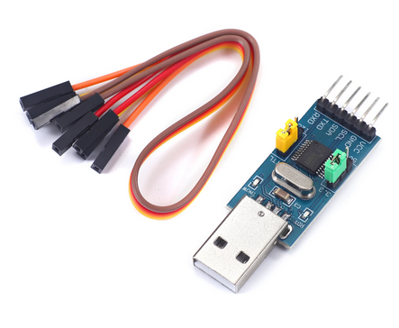

# ch341_i2c

This is a Rust [embedded-hal] implementation for the ch341 chips,
such as the inexpensive [ch341t-dongle] (1.31 USD as of Nov 2022).



This enables development of embedded device drivers on a PC without the use of
a microcontroller, using the same hal trait definitions. The ch341 devices interface with a PC via USB, and
provide a synchronous serial engine to interface with I2C embedded devices.

This library uses [libusb] internally and thus does not rely on any device-specific kernel driver. The implementation is influenced by the out-of-tree linux driver [i2c-ch341-usb].

## I2C interface limitations

By default, the library uses the standard I2C bus speed of **100 kbps**. I2C bus speeds of 20 kbps, **400 kbps** and 750 kbps are also available.

The CH341A only supports **7 bit addressing**.

Due of the limited CH341A USB endpoint buffer size of 32 byte that is used for I2C data as well as adapter in-band signaling, the library supports only I2C messages with a **maximum data size of 26 bytes**.

## Device configuration

ch341 chips can alternatively be configured as UART devices or as I2C adapters (which is what we want).
On the module shown, this is controlled via a jumper. Make sure your jumper is set to I2C mode before
plugging the device. It should enumerate like so in `sudo lsusb`:
```
Bus 001 Device 029: ID 1a86:5512 QinHeng Electronics CH341 in EPP/MEM/I2C mode, EPP/I2C adapter
```
See full lsusb output 

## Requirements

You need to have libusb libraries installed in your system (e.g `sudo apt install libusb-1.0-0 libusb-1.0-0-dev`)

## Udev rules

In order to avoid running your code as root to gain access to the ch341 device in Linux, you may want to create a uded rule file e.g `/etc/udev/rules.d/99-ch341.rules` with the following contents:
```
SUBSYSTEM=="usb", ATTRS{idVendor}=="1a86", ATTRS{idProduct}=="5512", MODE:="0666"
```
And plug / unplug the device for the udev settings to apply. 

## Example usage

Checkout the `examples` folder for code examples, build the examples using `cargo build --examples`

[i2c-ch341-usb]: https://github.com/allanbian1017/i2c-ch341-usb/blob/master/i2c-ch341-usb.c
[embedded-hal]: https://github.com/rust-embedded/embedded-hal
[ch341t-dongle]: https://www.aliexpress.us/item/3256802893948048.html
[udev rules]: https://github.com/ftdi-rs/libftd2xx-rs/#udev-rules
[libusb]: https://docs.rs/libusb/latest/libusb/
